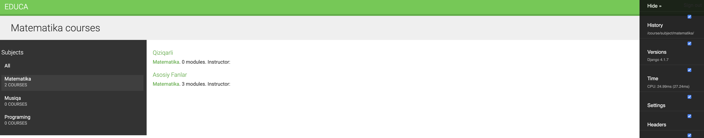
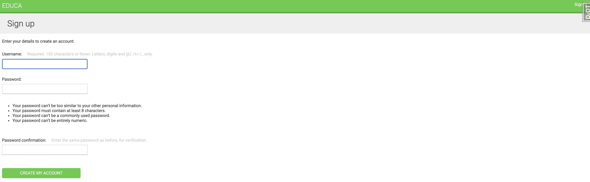
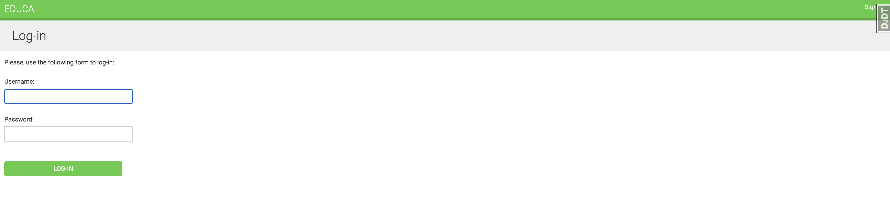
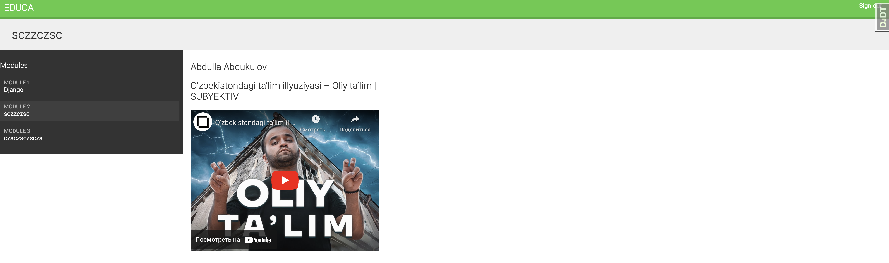
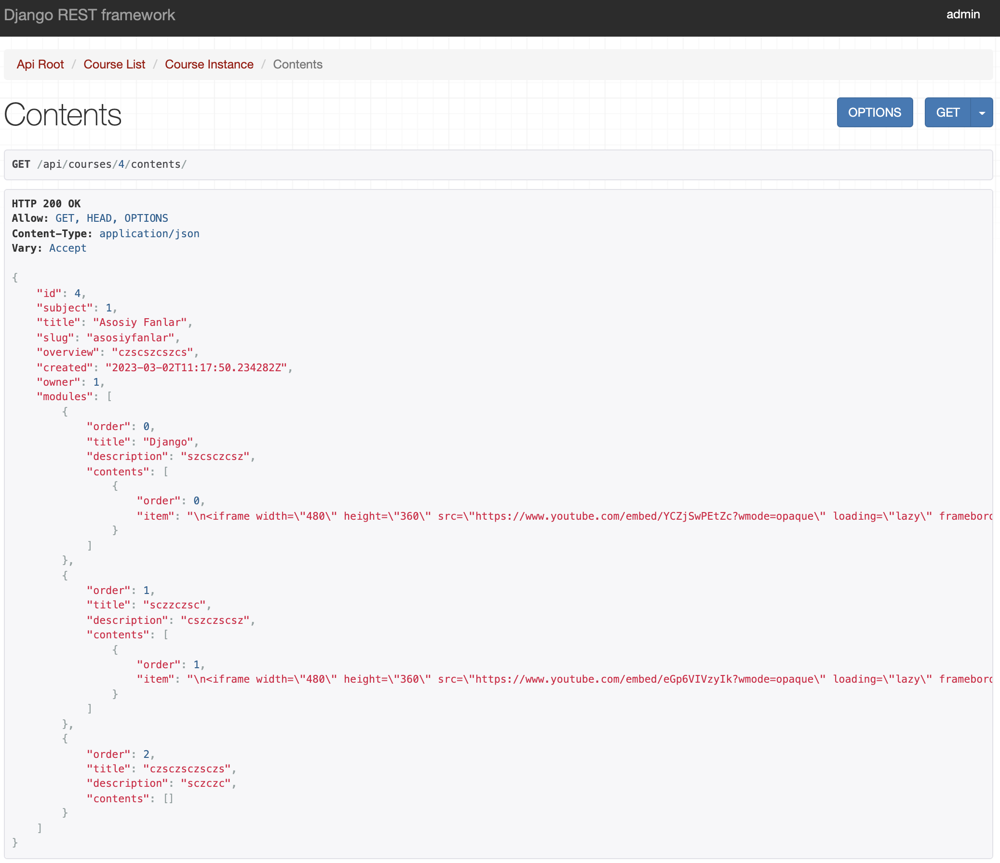
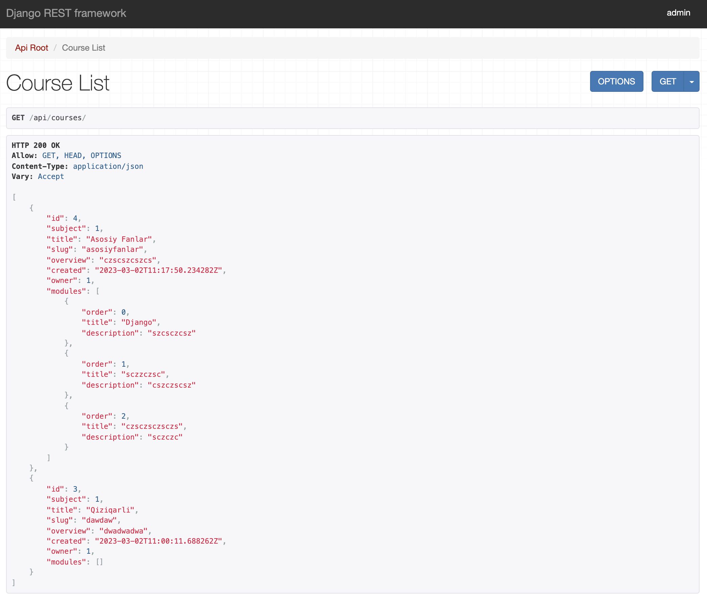

# E-Learning-Platform-Django

<h3>Online learning platforms are a great example of applications where you need to provide tools to create content with flexibility in mind.</h3>
<h4>In this unit you will learn:</h4>

- Create models for CMS
- Create fixtures for your models and apply them
- Use model inheritance to create data models for polymorphic content
- Create custom model fields
- Order course content and modules
- Create authentication views for CMS

<h1>Installation:</h1>

- pip install -r requirements.txt
- python manage.py migrate
- python manage.py createsuperuser

<h2>Redis:</h2>

- docker run -it --rm --name redis -p 6379:6379 redis
- docker run -it --rm --name memcached -p 11211:11211 memcached -m 64
- python manage.py runserver

<h3>Django Rest Framework</h3>

- Install Django REST framework
- Create serializers for your models
- Build a RESTful API
- Create nested serializers
- Build custom API views
- Handle API authentication
- Add permissions to API views
- Create a custom permission
- Implement ViewSets and routers
- Use the Requests library to consume the API

